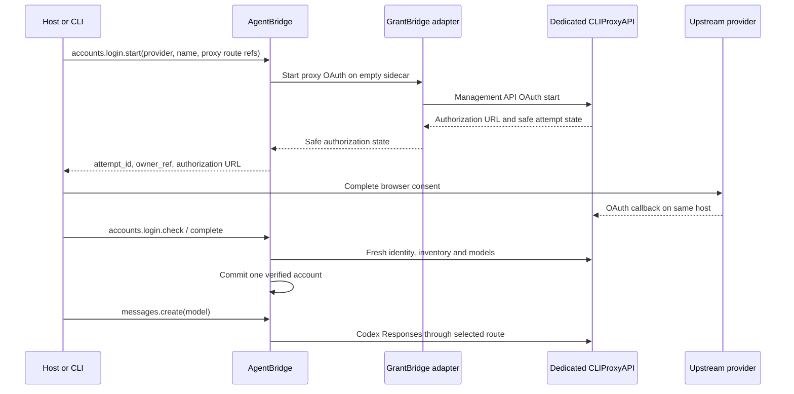

# GrantBridge and proxy architecture

GrantBridge coordinates account authorization, while CLIProxyAPI is the
credential holder and the Codex Responses gateway. AgentBridge owns durable
account and turn state. There is one onboarding flow for `codex`, `claude` and
`grok` providers.

## Boundaries

- AgentBridge holds durable login attempt state. GrantBridge coordinates OAuth
  through the sidecar Management API. It exposes sanitized status and does not return
  raw provider errors, codes or tokens to AgentBridge.
- CLIProxyAPI holds the OAuth session state and stores and renews upstream
  credentials in its private auth directory. Each sidecar has one credential
  and a separate loopback port.
- AgentBridge stores route and environment variable **names**, fingerprints
  of allowed identity evidence, and observed model and quota metadata. It does
  not store key or token values.
- Codex receives only the proxy client key. The management key is used for
  login and fresh route checks and is never sent to Codex.
- The host authenticates its user and controls permissions and business
  policy. Neither GrantBridge nor CLIProxyAPI receives Fullbrain mission state.

`accounts.login.complete` repeats fresh checks and binds the account only when
one stable upstream identity and a local model catalogue are observed. Pinned
routes pass the same Management API check as automatic routes. During a turn,
AgentBridge fixes the chosen endpoint and does not retry through another
account. A later switch uses bounded portable context and explicit omissions.

A local Management API observation is not live model entitlement. The current
browser mode is same-host; a remote phone/browser callback has no acceptance
claim. Earlier GrantBridge native provider homes are historical state and do
not enable a second execution or account creation flow.
