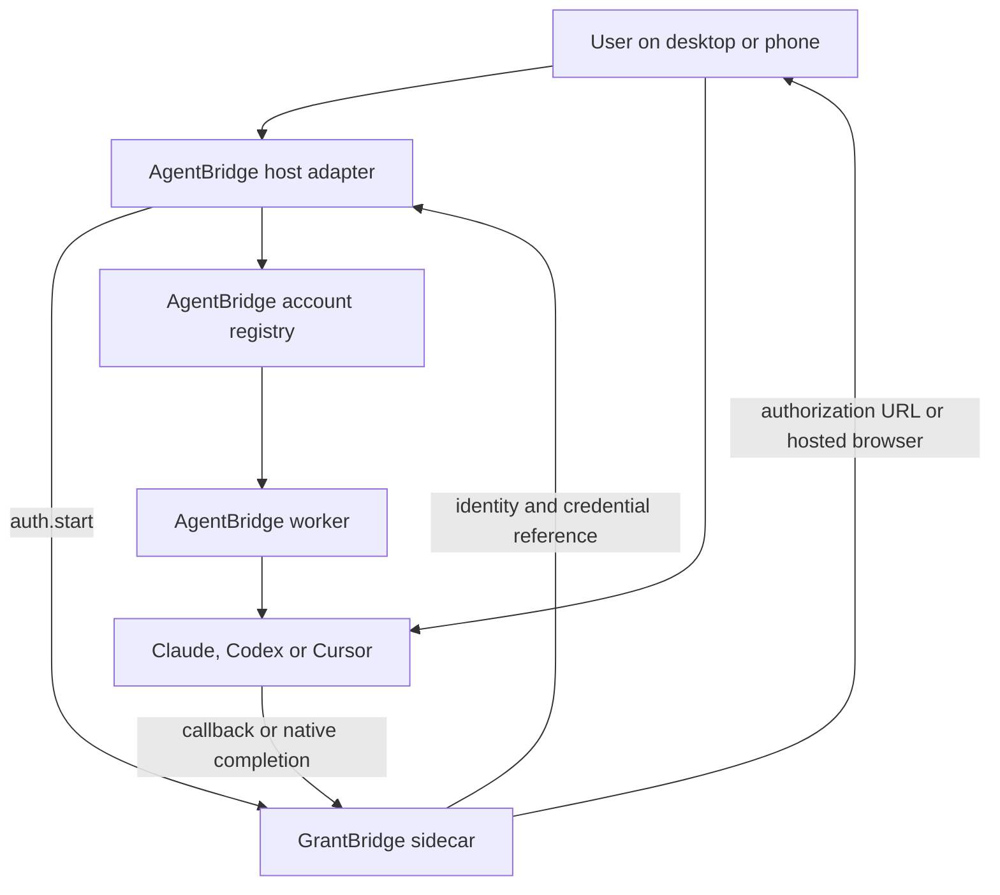

# Architecture and ownership

AgentBridge must not grow a second implementation of OAuth or provider-specific consent. GrantBridge owns that concern and AgentBridge consumes its result.

## Proposed responsibility boundaries

The following ownership is the target design. Provider-specific gaps in today's implementation are listed in [current-api.md](current-api.md).

### GrantBridge owns

- OAuth 2.0, OpenID Connect and MCP authorization code flows.
- State, PKCE, issuer and callback validation.
- Provider consent and browser automation mechanics; the host owns the authenticated viewer and public routing.
- Credential storage, refresh-token rotation and revocation where the provider supports them. Native CLI profiles are distinct from the encrypted OAuth/Cursor vault.
- Native login adapters for Claude, Codex and Cursor.
- Authentication evidence and provider-neutral identity results.

GrantBridge must not depend on AgentBridge workspaces, prompts, sessions, tool permissions or retry policy. Its optional fixed inference probe is an acceptance tool, not a general execution API or an automatic login step.

### AgentBridge owns

- Its account registry and stable account IDs.
- Session and run admission, process supervision, stop and recovery.
- Native provider execution after an account has been prepared.
- Normalized events, usage observations and portable context.
- Binding a run to the account explicitly selected by the host. Account fallback policy belongs to that host. Authentication status is an observation; it is not permission to perform a business operation.

AgentBridge must never copy OAuth tokens into its SQLite records, prompts, argv, event stream or account configuration.

## The host owns

The host maps its authenticated user to an account owner, decides who may connect or use an account, and decides whether a login is shown in a terminal, desktop browser or remote mobile browser. In the standalone development phase, AgentBridge's CLI is the host. In production, Fullbrain can become the host.

## Account identity

An AgentBridge account has a stable ID and engine. The authentication adapter must return an identity that can be checked against the requested account. A successful reauthentication updates the credential material for the same account only when the provider identity matches the account identity. A different identity requires a new account ID or an explicit replacement flow.

For Claude and Codex, the account reference is expected to include an isolated native home. For Cursor, the account reference should point to a credential provider, not contain the API key itself.

Keep four concepts separate: host owner, stable account ID, temporary authentication attempt ID, and credential generation. Reauthentication creates an attempt and a new credential generation; it must preserve the stable account and its conversations. GrantBridge's current attempt ID cannot serve as the permanent account ID.

Keep the adapter optional through a provider-neutral authentication interface. AgentBridge's CLI can select GrantBridge as its development backend. An embedding application can supply an already prepared account or another authentication backend without loading Node.js.
